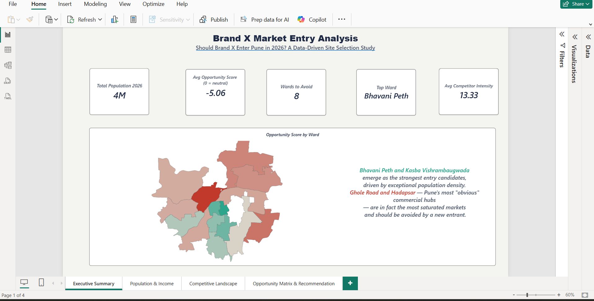
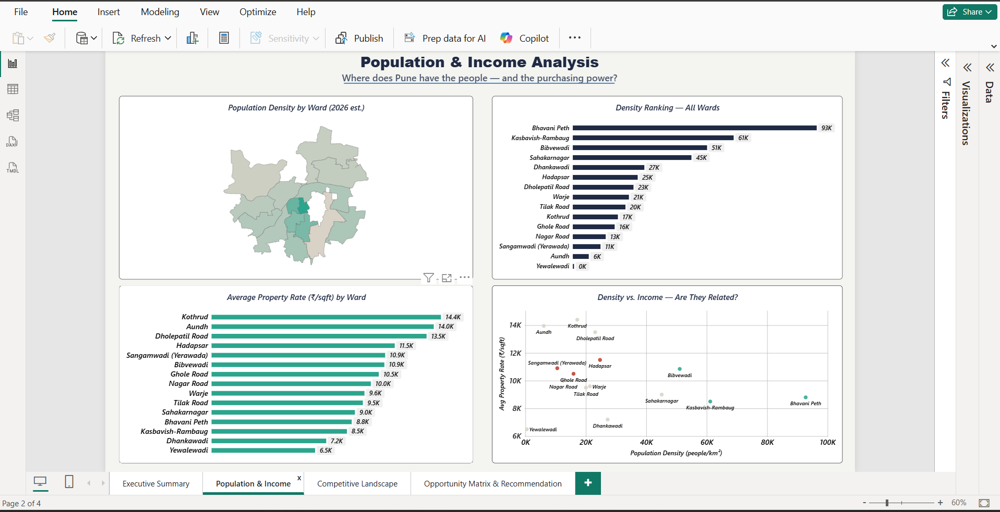
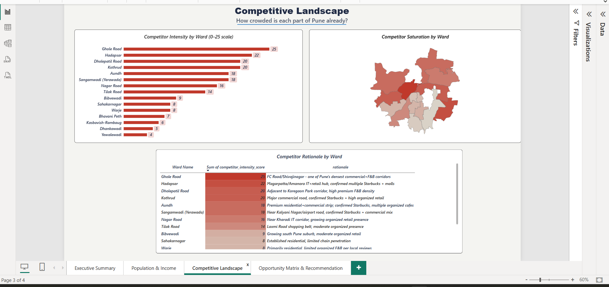
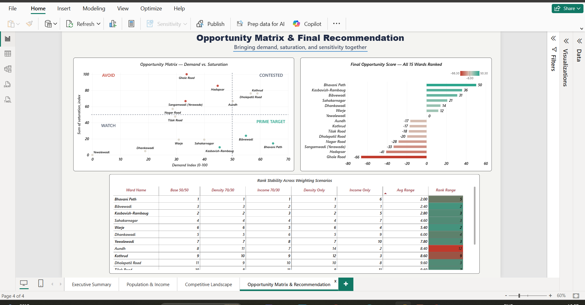

# Brand X Market Entry Analysis: Pune 2026

**Business question:** Should Brand X (a retail/F&B chain) enter Pune in 2026, and if so, in which ward?

I scored all 15 of Pune's administrative wards on demand and competition, then tested how much the answer depends on my own assumptions. The result is a Python pipeline (8 scripts), a 4-page Power BI dashboard and a written report.

## Key findings

- **Best entry candidates:** Bhavani Peth (score 50.3), Kasba Vishrambaugwada (36.0) and Bibvewadi (31.1). All three combine high population density with low existing competition.
- **Wards to avoid:** Ghole Road (-66.3), Hadapsar (-40.9) and Sangamwadi (-33.4). Ghole Road ranks last under all 5 weighting scenarios tested.
- **8 of 15 wards score below zero**, meaning competition outweighs demand.
- **Robustness:** the top 3 stay the same under 4 of 5 weighting scenarios. Under income-only weighting, Bhavani Peth drops to 6th and Aundh jumps to 2nd. So the recommendation suits a high-footfall, value-priced brand, not a luxury one.

## Method

| Pillar | Measure | Source |
| --- | --- | --- |
| Population density | 2026 estimated population / ward area (km²) | Census 2011 grown at 2% a year; area from ward boundary polygons |
| Income | Average property rate (₹/sqft) as a proxy | Listing sites (7 wards sourced, 8 estimated from nearby areas) |
| Competition | Competitor intensity score (0 to 25) | Hand-scored from researched chain presence (e.g. Starbucks) and commercial character |

```
Demand Index     = 50% density + 50% income   (each scaled 0-100, min-max)
Saturation Index = competitor score           (scaled 0-100)
Opportunity      = Demand Index - Saturation Index
```

The 50/50 weighting is an assumption. `08_sensitivity_analysis.py` re-ranks the wards under five weightings (50/50, 70/30, 30/70, 100/0, 0/100).

Ward names follow the census file's spelling (for example Bibvewadi). The boundary file spells some names differently (Bibwewadi), so `03_compute_area_density.py` uses a hand-built lookup table to join the two files.

## Limitations

- **Yewalewadi data is incomplete.** The source census file has only 1 sub-ward (7,685 people) for Yewalewadi (Admin Ward 15), against 9 to 13 for most wards. Its population and density are understated. I re-ran the scoring with its 2011 population set to 100k, 200k and 300k, and the top 3 wards did not change.
- **Yewalewadi's ward match is inferred.** The census file lists "Yewalewadi" and the boundary file lists Admin Ward 15 as "Kondhwa Wanavdi". I paired them by elimination (the only unmatched names), not from a source that links them.
- Census data is from 2011 and projected forward with an assumed 2% growth rate.
- 8 of 15 property rates are estimates, not sourced figures (including Kasba Vishrambaugwada).
- Competitor scores are directional estimates, not exact outlet counts.

## Project structure

```
data/raw        source census CSV and ward boundaries (GeoJSON)
data/cleaned    intermediate files produced by the scripts
python/         8 numbered scripts, run in order
outputs/        final scored table, sensitivity table, map files for Power BI
powerbi/        brand-x-pune-market-entry-dashboard.pbix
images/         dashboard screenshots used in this README
```

| Script | What it does |
| --- | --- |
| 01_load_and_explore | Loads and checks both raw files |
| 02_clean_census_data | Removes subtotal rows, aggregates 160 sub-wards to 15 wards |
| 03_compute_area_density | Matches ward names, computes area (shoelace formula), density, 2026 projection |
| 04_income_proxy | Property-rate income proxy (sourced vs estimated) |
| 05_competitor_index | Competitor intensity scores |
| 06_opportunity_scoring | Normalises, combines and scores the wards |
| 07_export_for_powerbi | Adds a joinable ward name to the map file |
| 08_sensitivity_analysis | Tests rank stability under 5 weightings |

The Power BI Shape Map uses a TopoJSON version of the ward boundaries, converted from the GeoJSON file.

## Dashboard

### 1. Executive Summary
Headline KPIs and the opportunity map.



### 2. Population & Income
Density and property-rate views.



### 3. Competitive Landscape
Competitor intensity by ward.



### 4. Opportunity Matrix & Recommendation
Demand vs saturation, final ranking and rank stability.



## How to run

```
pip install pandas
cd python
python 01_load_and_explore.py
python 02_clean_census_data.py
# ... continue in numeric order through 08
```

Run the scripts from inside the `python` folder, because the paths are relative.

## Tools

Python (pandas), Power BI (DAX, Shape Map)
